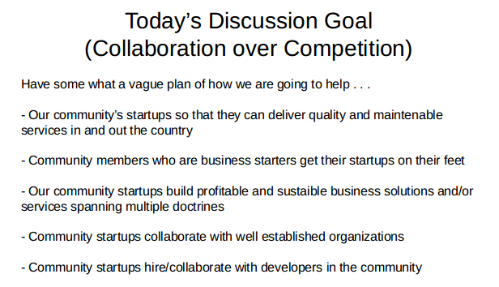

# Startups
## Introduction
With attempts to re ignite the community, we focused on how we can emphasize collaboration over competition in the community by finding a proper way to aid/assist startups and freelance developers.

## Definitions
This article will specify some definitions to better cover the context of the meeting
- Entity: Can be an individual developer (freelance or not), a business, a company, or any coorporate structure.

## Main Agenda

## Must Knows
The meeting happened to stumble on tasks/projects that can be or are being conducted by entities of the community. These were grouped into to two:-
- Tender projects (Ones which are issued by a client)
- Startup idea (Projects spawned by a community member)
### Tender Projects
The community has very little interest in these projects at the moment, as these projects tend to be driven by the client and the entity that serves the client. Only that the community urges the developer (be it an individual or a corportate/business) to deliver quality and meaintable software to keep the praise of the community

### Startup Ideas
If a community member has an idea and somehow lacks the man power on how implement it whatever the reasons, the idea can be presented to the community. It will be sorted and properly prioritized, and the community as a whole will drive the idea forward. This led to the term, Community Driven Ideas (CDI). Ofcourse there are going to have to be a proper documentation on how the community and the owner of the idea benefits from all of this, and this documentation will be one of the factors used to prioritize the idea.

## Achievment
After a very deep dive into this dicussions, It was generally agreed upon that for us to help the community, we need to be able to
- Identify each and every startup/developer/organisation/business that needs help
- Identify each and every startup/developer/organisation/business that can provide help

Both of the points above generally mean to be able to identify down to the skills level, each member of the TDC, be it a developer, a company, or any other entity. And by doing so, we can map a help provider to a help seeker.

Example 1: If an entity is trying to find a company/developer that it can partner up with to assist in financial systems intergrations/development/auditing, then we (as a community), need to be able to identify entities that have experties in the finance field, that way, one can know who to partner up with

Example 2: If someone comes up with an idea and delivers it to the community to benefit the power of CDI's, suppose the idea is strongly based on AI and Neural Networks, we will need to identify an entity with interests, time and experties in that area to push the idea forward

## Way Forward
Since it is obvious that we need to tackle this entity identification problem first, we need to find a way to use the current available tools (maybe a github repo?) while developing a strong platform where all community memebers will register and specify there skill levels. This will include Students, Freelances, Individual developers, Companies, Teams e.t.c.

Based on the discussions we will be having in our [telegram group](https://t.me/tanzaniadeveloperscommunity), we will see what is the best tool to currently use and further more, how we will develop the TDC platform while we are at it. 

Regards,
Tchao
